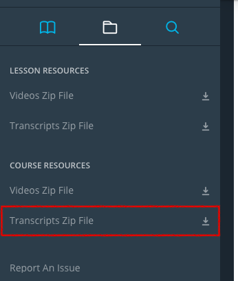
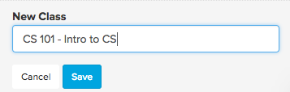
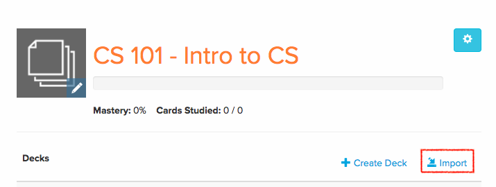
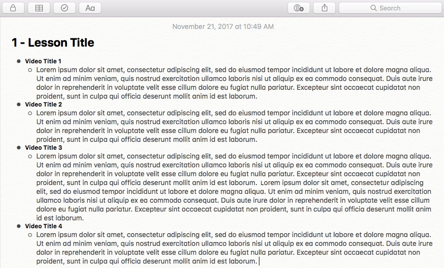

# SRT Parser
This script is designed to read directories full of `.srt` files (specifically with Udacity lectures in mind), and do the following:
* Output `.html` files, one per lesson, with trascripts in bulleted note format, which can be imported into the Mac Notes app (or any notes app you prefer that allows importing of `.html` files).
* Output `.csv` files, one per lesson, with transcripts listed in the proper format (one video per row), to be uploaded to Brainscape for automated flashcard generation. The front of the card will be the video title, and the back of the card will be the full transcript from that individual video.

## How to Use
1. Download `parse_srt.py`.
2. Download all transcripts from your Udacity course. To do so, open a course in a browser, watch any video, click the Folder icon in the left sidebar, then click **Transcripts Zip File** to download all transcripts for that course.

3. Open Terminal.
4. Navigate from the command line to the directory containing the `parse_srt.py` Python script.
5. Enter the command `python parse_srt.py <full_path_to_class_transcripts>`.
6. The script will create a folder called `output` inside of the course transcripts directory. Within that, it will create a "html" directory and a "csv" directory, and output all files to the appropriate folder.

## What to Do With the Output
### Create Flashcards
This is not the traditional use for flashcards, but some may find it helpful to read and re-read course transcripts on their smartphone while on the go and rate themeslves on how well they know the content of each lecture.
1. After completing the above steps, go to your Brainscape account.
2. Create a new "class" (give it the name of the course you're taking).

3. Once inside your Brainscape class, click *IMPORT*.

4. In the import GUI, select all of the `.csv` files inside of the "csv" folder. This will create a deck for each lesson in the course. The name of the deck will autohatically be the name of the lesson.
5. Once the decks are created, you can edit individual cards in your browser using Brainscape's Advanced Editor to add bolding, underline, make corrections to the transcript text, add images, etc. You can also add more flash cards to your decks later if there are individual small topics and questions you need to improve on.
### Import into Notes App
1. Open the notes app of your choosing, as long as it allows importing of .html files.
2. Import the `.html` files from the "html" directory created by the script into the notes app.
3. Watch lecture videos and edit the imported notes however you wish (bold certain things, make more sub-bullets, add screenshots from lecture, etc.).
Here's how the imported `.html` file will look in the Mac Notes app, (video titles will be populated with the actual titles):

